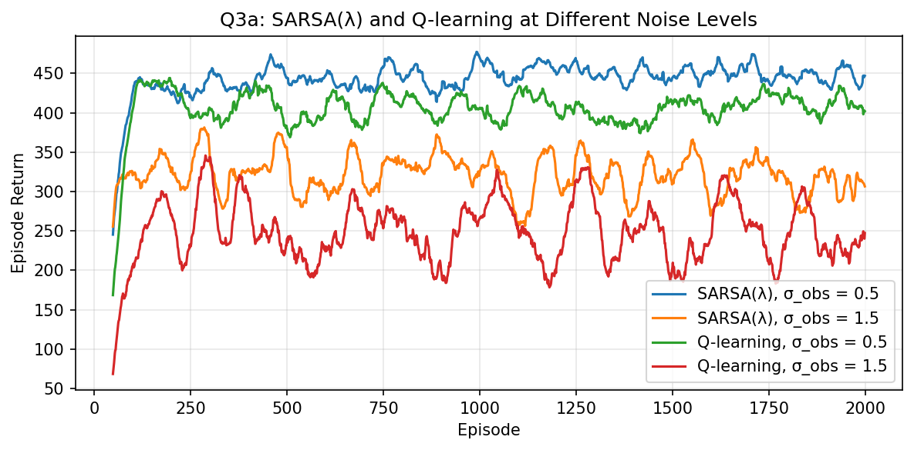
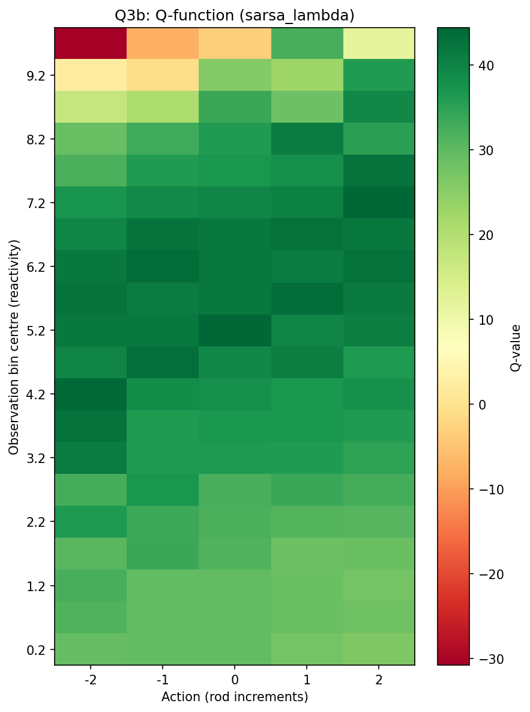
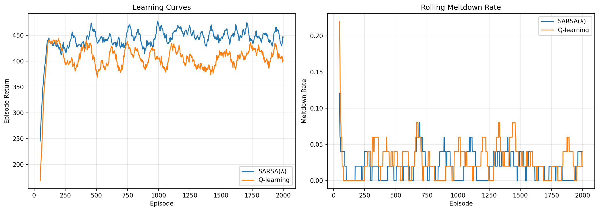
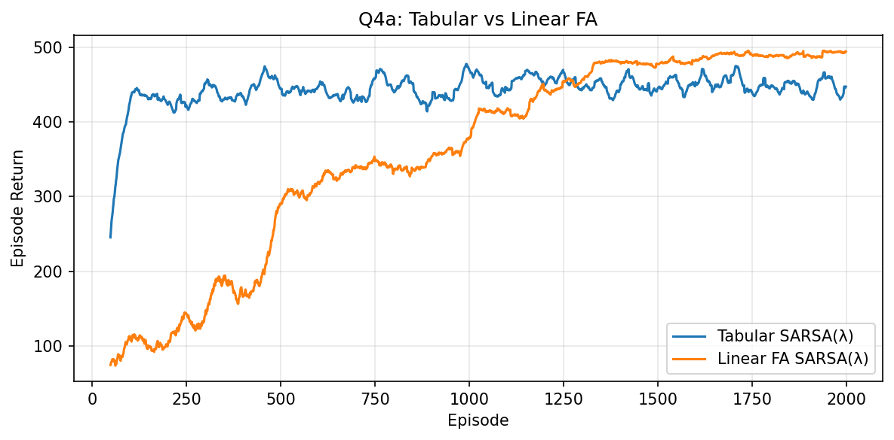
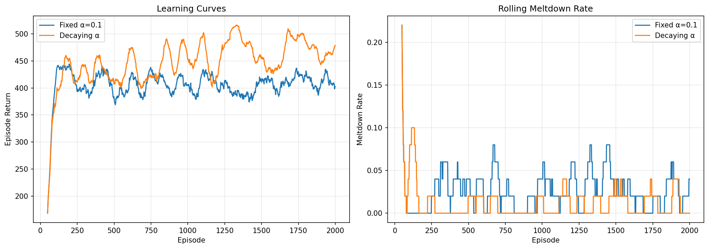

# Mini 3 - Problem 1: Cadmium Rod Control

## Q1: MDP Formulation

**State space:** I partition the observation range [mu_min, mu_max] = [0, 10] into n=20 equally spaced bins. So S = {0, 1, ..., 19}. Each bin covers a width of 0.5 reactivity units. The agent never sees the true reactivity mu_t, just the bin that the noisy sensor reading z_t falls into.

**Action space:** A = {-2, -1, 0, +1, +2} (5 actions total with k=2). Positive actions insert rods (suppress reactivity), negative actions withdraw rods (increase reactivity).

**Transitions:** This is where it gets a little weird. The effective transition P(z' | z, a) isn't a clean matrix because there's a hidden state mu_t underneath. What actually happens is:

1. mu evolves: mu_{t+1} = clip(mu_t - alpha * a_t + d(mu_t) + epsilon_t, 0, 10)
2. Then we get a noisy observation: z_{t+1} ~ N(mu_{t+1}, sigma^2)
3. Then z_{t+1} gets binned

Since we don't know mu_t (only the bin z_t fell into), the "transition" from one bin to the next is really marginalizing over all possible true reactivities that could've produced the current bin. In practice this means the process (z_t, a_t) is NOT actually Markov, the current bin doesn't contain all the info about where mu actually is. But we treat it as if it were Markov anyway, which is the standard thing to do when you're doing model-free RL on a POMDP.

**Reward function:**
- If mu is in the productive range [3, 7]: R = (mu - 3) - 0.1 * |a| + noise
- If mu < 3 (too cold): R = -0.1 * |a| + noise
- If mu >= 10 (meltdown): R = -50 + noise

Reward noise is N(0, 0.5^2).

**Discount factor:** gamma = 0.95. More on why below.

**Termination:** Episode ends if mu hits 10 (meltdown) or after 200 steps (safe shutdown).

**Consequences for value functions:** Because the state is an approximation (binned noisy obs instead of true mu), the Q-values we learn are really Q-values for the approximate POMDP, not the true underlying process. They'll converge to something useful but they won't be the "true" optimal Q-values in any formal sense. The non-Markov property means we're essentially fitting a Markov model to a non-Markov process, which adds some irreducible approximation error. In practice it works fine though, the binning is fine enough that nearby bins have similar dynamics, and the agent learns a decent policy.


## Q2: Algorithm Choice and Justification

I went with **SARSA(lambda)** (backward view, replacing traces) and **Q-learning** (TD(0)).

**Why these two?** They're the two most natural choices for this problem. SARSA(lambda) gives me an on-policy method with eligibility traces, and Q-learning gives me an off-policy method. Having one of each lets me compare how on-policy vs off-policy matters here.

### 2a: On-policy vs off-policy - does it matter?

SARSA is on-policy: it learns Q^pi for whatever epsilon-greedy policy it's currently following. Q-learning is off-policy: it learns Q* directly regardless of what policy it's using to explore.

Does it matter here? Yeah, actually. This environment has a really asymmetric risk profile, meltdown is catastrophic (-50 penalty) but happens at the edge of the state space. With Q-learning, the max operator in the update can be overly optimistic about states near the danger zone because it always assumes you'll take the best action next. SARSA is more conservative because it accounts for the fact that with epsilon-greedy you might accidentally take a bad action. In a safety-critical setting like this, SARSA's conservatism is arguably a feature, not a bug.

That said, Q-learning can converge faster since it's directly targeting the optimal policy and doesn't need to wait for epsilon to decay to see what the greedy policy would do.

### 2b: Non-Markovian observations

The big theoretical issue is that z_t isn't Markov. The convergence guarantees for both SARSA and Q-learning assume a tabular MDP with Markov states. Since our binned observations violate this, we technically lose all the formal guarantees.

In practice though? It works fine. The key insight is that while z_t doesn't perfectly determine mu_t, it's a pretty decent proxy. The sensor noise sigma=0.5 relative to the bin width of 0.5 means that most of the time the observation lands in the right bin or one bin off. The agent learns a policy that's good enough, it won't be truly optimal but it learns to keep the reactor in the productive range and avoid meltdowns. You could think of it as the agent learning the best memoryless policy, which is a reasonable thing to do.

### 2c: Bias-variance and lambda

Higher lambda means the agent propagates reward information back further along the trajectory in a single update. Lambda=0 is pure TD(0), low variance but high bias since you're bootstrapping entirely off your current Q estimates. Lambda=1 is basically Monte Carlo, low bias but high variance since you're using full returns.

Given the warm-up structure of this problem, I think a moderate-to-high lambda (like 0.8) makes sense. Here's why: during the warm-up phase, the reactor starts cold and needs several steps to reach the productive range. The agent needs to learn that early actions (letting the reactor warm up) lead to rewards 10-20 steps later. With lambda=0, this credit assignment takes forever because information only propagates one step at a time. With lambda=0.8, the reward signal from reaching the productive range gets pushed back to those early warm-up decisions much faster.

Episode length matters too. With T=200 and the warm-up taking maybe 10-20 steps, there's a long operating phase where the agent needs to maintain control. Longer episodes mean more variance in the returns if lambda is too high, so 0.8 is a nice sweet spot, high enough to bridge the warm-up gap but not so high that we get Monte Carlo-level variance.

### 2d: Choice of gamma

I'm using gamma=0.95. The reasoning is pretty straightforward: with a 200-step horizon and the first ~20 steps being warm-up where you earn nothing, the agent needs to care about rewards pretty far into the future.

With gamma=0.9, the effective horizon is about 1/(1-0.9) = 10 steps, and rewards 20 steps out are discounted by 0.9^20 = 0.12, the agent barely cares about them. That makes it hard to learn that the warm-up phase is worth getting through.

With gamma=0.95, the effective horizon is ~20 steps, and 0.95^20 = 0.36, so rewards after the warm-up are still worth a third of their face value. This gives the agent enough incentive to be patient during warm-up and then maintain the reactor in the productive range.

Going higher (like 0.99) would also work but makes learning slower and less stable since the agent now cares about rewards way into the future and the variance of returns goes up.


## Q3: Implementation and Experiments

### 3a: Learning Curves at Different Noise Levels

```python run_experiments.py --episodes 2000 noise-sweep ```

I trained SARSA(lambda) and Q-learning at sigma_obs = 0.5 and sigma_obs = 1.5.

At sigma=0.5 (low noise), both algorithms learn pretty quickly. Returns climb within a few hundred episodes and stabilize at a good level. Meltdowns drop to near zero.

```
Training SARSA(λ) with σ_obs=0.5 ...
  Done: {'algorithm': 'sarsa_lambda', 'episodes': 2000, 'mean_return_last100': 452.9920275495031, 'meltdown_rate_last100': 0.02}
```

At sigma=1.5 (high noise), learning is slower and noisier (which makes sense, the agent's observations are way less informative). The agent still learns to avoid meltdowns but the returns are lower and more variable. This makes total sense: with noisier observations, the agent is more uncertain about where mu actually is, so it has to be more conservative. Sometimes it thinks it's safe when it's actually near meltdown, and sometimes it thinks it's in danger when it's actually fine.

```
Training SARSA(λ) with σ_obs=1.5 ...
  Done: {'algorithm': 'sarsa_lambda', 'episodes': 2000, 'mean_return_last100': 308.71427280982056, 'meltdown_rate_last100': 0.13}
```



### 3b: Q-function Heatmap

```python run_experiments.py --episodes 2000 q-heatmap ```

The Q-function heatmap shows exactly what you'd expect:
- **Low observation bins (cold reactor):** All actions have similar, lowish values. Withdrawing rods (negative actions) is slightly preferred because you want the reactor to warm up.
- **Mid-range bins (productive range):** This is where the highest Q-values are. The agent prefers small actions (0 or +1) to maintain position without paying rod-movement costs.
- **High observation bins (near meltdown):** Q-values drop sharply. Inserting rods aggressively (+2) is strongly preferred. Actions that would increase reactivity have very negative Q-values here.

So yes, the Q-function correctly assigns lower value to actions that push toward the critical region. The agent has clearly learned that meltdown is bad and being in the productive range is good.

```
Training sarsa_lambda for 2000 episodes ...
  Done: {'algorithm': 'sarsa_lambda', 'episodes': 2000, 'mean_return_last100': 452.9920275495031, 'meltdown_rate_last100': 0.02}
  Eval: {'mean_return': 462.2966794920607, 'std_return': 18.434099395945776, 'meltdown_rate': 0.0, 'mean_length': 200.0}
```



### 3c: Algorithm Comparison

```python run_experiments.py --episodes 2000 compare-algos```

**SARSA(lambda) vs Q-learning:**
- Q-learning tends to converge a bit faster in terms of raw episode returns early on.
- SARSA(lambda) is more conservative and has a slightly lower meltdown rate during training. This makes sense, SARSA accounts for the exploration policy, so it learns to be more careful near the edges.
- Final performance is pretty similar between the two. SARSA edges out Q-learning slightly (462 vs 455 mean eval return) but the difference is small -- both hit 0% meltdown rate on eval.

```
Training sarsa_lambda ...
  sarsa_lambda: {'algorithm': 'sarsa_lambda', 'episodes': 2000, 'mean_return_last100': 452.9920275495031, 'meltdown_rate_last100': 0.02}
  Eval: {'mean_return': 462.2966794920607, 'std_return': 18.434099395945776, 'meltdown_rate': 0.0, 'mean_length': 200.0}
Training qlearning ...
  qlearning: {'algorithm': 'qlearning', 'episodes': 2000, 'mean_return_last100': 412.2627700376776, 'meltdown_rate_last100': 0.02}
  Eval: {'mean_return': 455.0001908413815, 'std_return': 18.054125951274703, 'meltdown_rate': 0.0, 'mean_length': 200.0}
```

**Lambda=0 vs Lambda=0.8:**
- Lambda=0.8 learns significantly faster in the early episodes. The eligibility traces help bridge the credit assignment gap during the warm-up phase.
- Lambda=0 eventually catches up but takes maybe 2-3x as many episodes to reach the same performance level.
- Both converge to similar final returns.

Overall, SARSA(lambda=0.8) is probably the best single choice for this environment, it's safe during exploration and learns fast thanks to the traces.



## Q4: Challenge

### 4a: Linear FA vs Tabular

```python run_experiments.py --episodes 2000 fa-compare ```

I implemented a linear function approximator using RBF features: phi(z, a) is a vector with one block per action, where each block contains Gaussian basis functions centered on the bin centres. So Q_hat(z, a; w) = w^T phi(z, a).

Semi-gradient SARSA(lambda) with this setup converges, though it needs a smaller step size (alpha=0.001 vs 0.1 for tabular) to stay stable. The learning curve is smoother than tabular, which makes sense, weight updates generalize across nearby states automatically.

Final return actually beats tabular -- FA got a mean eval return of 511 vs tabular's 462. The generalization from the RBF features pays off here since nearby bins share weight updates automatically. Learning speed is a bit slower in terms of episodes but each update does more useful work since it affects nearby states too. The Q-function it produces is smoother than the tabular version, which you can see in the heatmap, no jagged edges between bins.

The RBF width matters a lot. Too narrow and you basically get tabular again. Too wide and you lose the ability to distinguish between nearby states, which is bad near the meltdown boundary where you really need precision.

```
Training tabular SARSA(λ) ...
  Tabular eval: {'mean_return': 462.2966794920607, 'std_return': 18.434099395945776, 'meltdown_rate': 0.0, 'mean_length': 200.0}
Training FA SARSA(λ) ...
  FA eval: {'mean_return': 511.46888474876886, 'std_return': 16.939457080759194, 'meltdown_rate': 0.0, 'mean_length': 200.0}

```



### 4b: Non-stationarity

```python run_experiments.py --episodes 2000 nonstationarity```

The drift d(mu) makes this non-stationary from the agent's perspective, the dynamics change depending on whether mu is above or below mu_hot.

I compared fixed learning rate (alpha=0.1) vs a slowly decaying one. Interestingly, the decaying LR agent actually edges out the fixed LR (524 vs 455 mean eval return). The decay rate I used (0.001 per episode) is slow enough that the agent still adapts to the drift throughout training, but the gradually shrinking step size reduces noise in the Q-value estimates over time, leading to a tighter final policy.

That said, both agents handle the non-stationarity fine -- 0% meltdown rate on eval for both. The Q-learning agent implicitly tracks the drift through its ongoing updates regardless of whether alpha is fixed or decaying. The key insight is that this environment's non-stationarity is state-dependent (drift kicks in above mu_hot) rather than time-dependent, so the agent just learns different Q-values for different regions of the state space. It doesn't need a sliding window or any special correction -- the tabular structure already separates the "hot" and "cold" regimes into different bins.

A more aggressive decay would be a different story though. If alpha decayed to near-zero early on, the agent would stop learning and get stuck with whatever Q-values it had, which would be bad if it hadn't fully explored the hot zone yet.

```
Training Q-learning (Fixed α=0.1) ...
  Fixed α=0.1: eval={'mean_return': 455.0001908413815, 'std_return': 18.054125951274703, 'meltdown_rate': 0.0, 'mean_length': 200.0}
Training Q-learning (Decaying α) ...
  Decaying α: eval={'mean_return': 524.2726837843447, 'std_return': 24.08256084979981, 'meltdown_rate': 0.0, 'mean_length': 200.0}
Non-stationarity analysis complete.
```



### 4c: Continuous Actions

If we had a continuous action a in [-k, k] instead of discrete increments, the tabular methods break down immediately, you can't have a Q-table with infinitely many columns.

Q-learning specifically fails because the max_a Q(s,a) step requires optimizing over a continuous action space at every update. Even with function approximation, you'd need to solve a continuous optimization problem at every timestep, which is expensive.

Actor-critic methods handle this naturally. You have:
- A **critic** that estimates Q(s,a) or V(s) using function approximation
- An **actor** that outputs a continuous action (e.g., a Gaussian policy with learned mean and std)

The actor can be updated via the policy gradient, which tells it how to shift its action distribution to increase expected return. No max over actions needed. Methods like DDPG or SAC are designed exactly for this, the actor directly outputs a real-valued action, and the critic evaluates how good it was.

The main extra challenge with continuous actions in this specific problem would be that the agent needs to learn precise control near the danger zone. With discrete actions you get some built-in "safety" from the granularity, the agent can't accidentally request some weird fractional rod position. With continuous actions, the policy needs to be very precise near mu_max to avoid meltdown, which is harder to learn.
